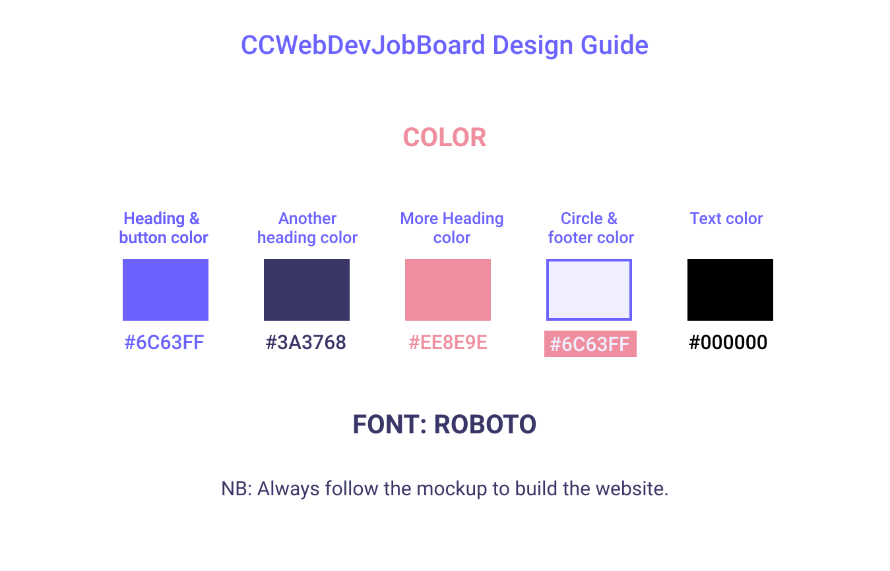

# Contributors Guidelines

Style Guide: 
(All steps can be done by multiple contributors or a single contributor) 

Adding a new page: 
1. Add an issue to GitHub for the page mockup.
2. Build a mockup following the Style Guide.
3. Submit a mockup to the issue.
4. Once mockup is accepted add an issue to build the new page following the mockup.
5. Assign issue to contributor or multiple contributor (splitting up the issue between multiple contributors).
6. Push new page as a new branch.
7. Add a pull request for the added page.
8. Pull request is accepted. 
9. Merge new page branch with dev branch.

Adding a new Feature:
1. Add an issue to GitHub for the new feature.
2. Assign issue to contributor or multiple contributor (splitting up the issue between multiple contributors).
3. Push new page as a new branch.
4. Add a pull request for the added feature.
5. Pull request is accepted. 
6. Merge new feature branch with dev branch.

